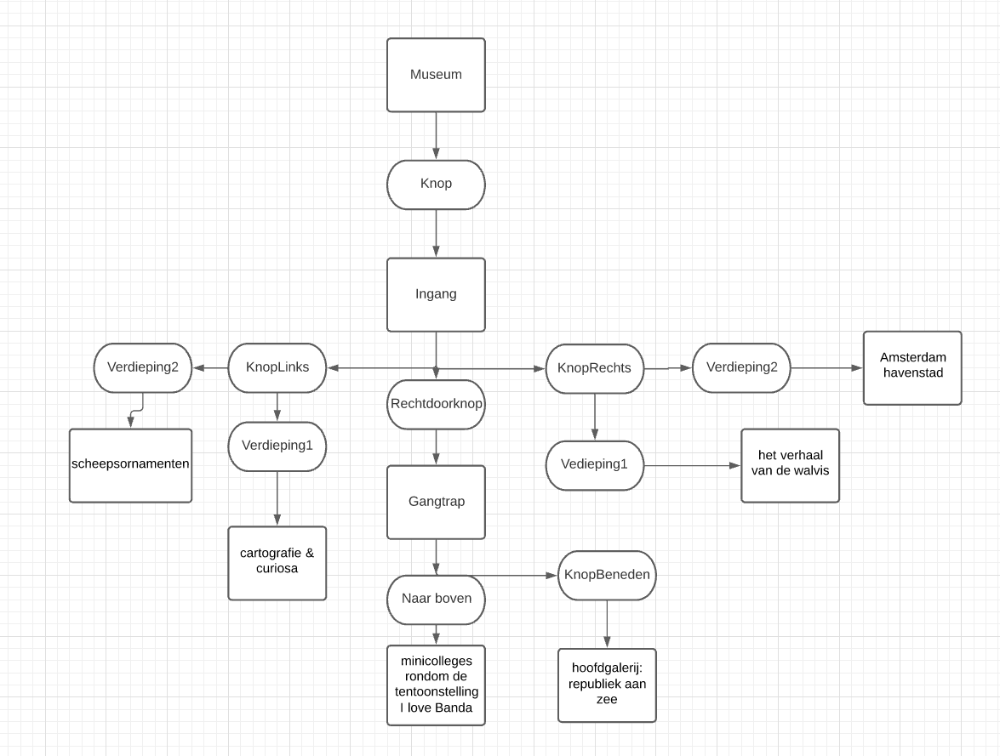

navigeren: er staan verschillende locaties waar je heen kan vanuit de locatie waar je op dat moment staat. Dan kan je invoeren waar je heen wil en als je daar dan bent veranderen de locaties waar je heen kan aangezien je op andere plek bent. Zo kan je verder navigeren of terug gaan

De gekozen ruimtes zijn eigenlijk alle ruimtes die daar te zien zijn met een link naar de individuele exposities